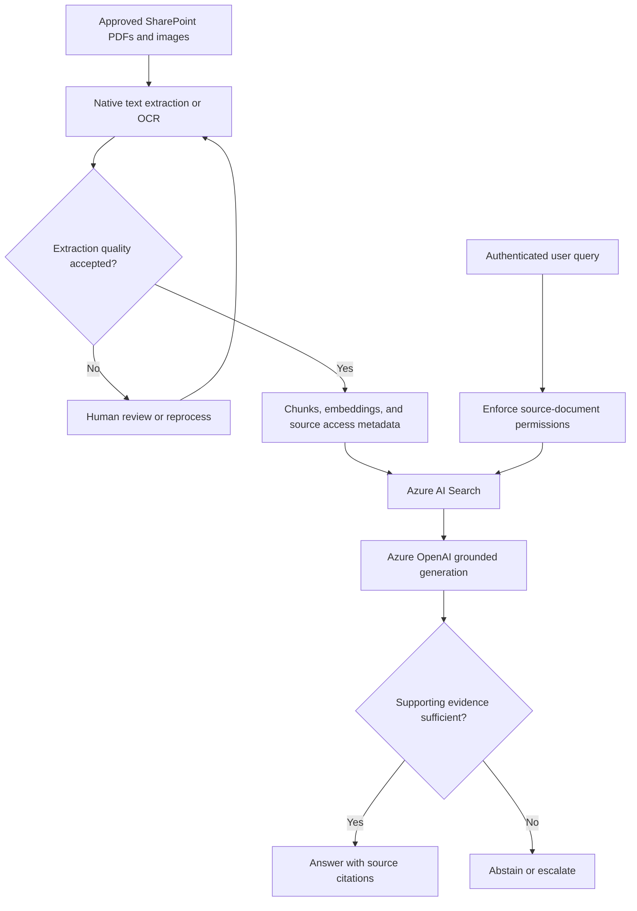

  

  <strong><a href="evidence/README.md">PROJECT EVIDENCE</a> &nbsp; / &nbsp; <a href="power-platform/README.md">POWER PLATFORM</a> &nbsp; / &nbsp; <a href="case-studies/README.md">CASE STUDIES</a></strong>

# Architecture that connects to delivery.

I’m **Jonathan “Jay” Clark**. I connect business processes, governed information, and automation across Microsoft 365, Power Platform, and applied AI. This portfolio brings together the architecture, implementation details, and engineering methods behind that work.

**21+ years in enterprise IT** · **The Cyber Consultants** · **Open to platform leadership and solutions architecture opportunities**

---

## Explore the work

<table>
<tr>
<td width="50%" valign="top">

### 01 / SharePoint DMS
**Architecture · PowerShell · Reconciliation**

Multi-site document management, destination readiness, migration planning, and scoped validation.

**Evidence:** A recorded 1,305-file pilot, documented exceptions, and runnable synthetic samples. Broader rollout remains in progress.

[Explore case study →](case-studies/property-portfolio-dms/README.md) · [Run the samples](evidence/verification-guide.md)

</td>
<td width="50%" valign="top">

### 02 / Power Platform governance
**Ownership · Solutions · Operations**

Centralized automation ownership, recovery of flows belonging to departed owners, and maintainable connection references.

**Evidence:** Reported 162-flow governance transformation. Scope and production continuity are described in the project account.

[Explore governance →](power-platform/platform-ownership.md) · [Claim PP-001](evidence/claim-register.md)

</td>
</tr>
<tr>
<td width="50%" valign="top">

### 03 / Business applications
**Power Apps · SharePoint · Power Automate**

Engagement-letter modernization, employee recognition, and tax-service intake with typed data and workflow integration.

**Evidence:** Reviewed control behavior, generalized formulas, and troubleshooting. Acceptance status is documented per application.

[Explore applications →](power-platform/README.md) · [View Power Fx](power-platform/power-fx-examples.md)

</td>
<td width="50%" valign="top">

### 04 / AI & knowledge systems
**Copilot Studio · RAG · MCP**

Grounded support, controlled escalation, and proposed boundaries between AI reasoning, enterprise knowledge, and tool execution.

**Evidence:** Reported help-desk delivery; separately labeled evaluation patterns and proposed MCP architecture.

[Explore AI patterns →](copilot-ai/README.md) · [View MCP design](mcp/tcc-core-mcp/README.md)

</td>
</tr>
</table>

## Architecture diagrams

- [Tablet, desktop, and flight-simulator deployment](case-studies/README.md#endpoint-deployment-flow)
- [Migration validation and cutover](case-studies/README.md#migration-validation-and-cutover)
- [Help Desk escalation](case-studies/README.md#help-desk-request-and-escalation-flow)
- [Departmental request workflow](case-studies/README.md#departmental-request-workflow)
- [Departmental AI access and action boundaries](case-studies/README.md#departmental-ai-access-and-action-boundaries)
- [PDF and OCR retrieval](#document-retrieval-and-answer-flow)

## Follow the evidence

**[Open the Project Evidence Portfolio →](evidence/README.md)**

A short path from a professional claim to its supporting material:

**Claim → Architecture → Implementation → Verification → Results & limits**

| Start with | What you can inspect |
| --- | --- |
| [Evidence register](evidence/claim-register.md) | Seven stable IDs connecting contributions to artifacts and acceptance status |
| [Offline verification](evidence/verification-guide.md) | Synthetic tests for mapping, readiness, reconciliation, and rejected inputs |
| [DMS results](case-studies/property-portfolio-dms/outcomes.md) | Pilot metrics, unresolved historical identities, and measurement boundaries |
| [Application testing](power-platform/testing-and-troubleshooting.md) | Failure scenarios, troubleshooting, and open acceptance work |

## Engineering focus

| Microsoft 365 | Power Platform | Applied AI | Delivery |
| --- | --- | --- | --- |
| SharePoint information architecture | Power Apps & Power Fx | Copilot Studio | PowerShell & PnP |
| Identity & access boundaries | Power Automate | Grounded knowledge & RAG | Microsoft Graph & APIs |
| Governance & document lifecycle | Solutions & connection references | Controlled tool integration | Migration & reconciliation |
| Operational ownership | Release & support practices | Evaluation patterns | Runbooks & recovery |

[Architecture decisions](architecture/README.md) · [Governance principles](governance/README.md) · [Career case studies](case-studies/README.md) · [GitHub profile](https://github.com/jclark1377)

## Microsoft AI certifications

- [Microsoft Certified: Agentic AI Business Solutions Architect Expert](https://learn.microsoft.com/api/credentials/share/en-us/JonathanClark-3652/CA6785E8D86C3C9B?sharingId=41029AD201067C66) — AB-100; earned October 2026.
- [Microsoft Certified: Azure AI Apps and Agents Developer Associate](https://learn.microsoft.com/api/credentials/share/en-us/JonathanClark-3652/657991F755E41849?sharingId=41029AD201067C66) — AI-103; earned October 2026.

The links open Microsoft Learn credential verification pages.

## Foundry, document intelligence, and sales knowledge

**Architecture design:** Sales document intelligence using Microsoft Foundry, Azure OpenAI, Azure AI Document Intelligence, Content Understanding, Azure AI Search, SharePoint, and Copilot Studio. Production deployment and business results are not claimed for this design.

The purpose is to turn approved proposals, client materials, PDFs, scanned documents, and images into searchable knowledge with grounded answers and source references.

| Component | Design responsibility |
| --- | --- |
| SharePoint | Approved content, document versions, ownership, and source permissions |
| Azure AI Document Intelligence | OCR and text/layout extraction from PDFs, scans, and images |
| Content Understanding | Structured extraction from document and image inputs |
| Azure AI Search | Text and vector retrieval with source metadata and access filtering |
| Azure OpenAI / Microsoft Foundry | Grounded answers, model selection, evaluation, and monitoring |
| Copilot Studio / Power Automate | User experience, approval routing, and controlled workflow actions |
| Entra ID | Authentication, RBAC, and least-privilege access |

### PDF, OCR, and image RAG approach

1. Admit approved documents and retain source identity, version, classification, and access metadata.
2. Extract native PDF text where available; use OCR for scanned pages and image text.
3. Review extraction quality, tables, reading order, and low-confidence fields.
4. Chunk content with document/page references, generate embeddings, and index text, vectors, and source metadata.
5. Enforce document access during retrieval and generate answers with citations. Abstain when evidence is insufficient.
6. Reprocess changed documents and remove withdrawn content; propagate permission changes.

OCR-based text retrieval and true image RAG require different evaluation. Image RAG additionally needs visual representations and a model capable of interpreting retrieved images. Authentication alone does not enforce source-document permissions in a custom search index.

### Document retrieval and answer flow

Proposed design for PDF and OCR text retrieval. Visual image retrieval requires separate image representations and evaluation. Source permissions must be enforced during retrieval.

### Sales use cases

- Retrieve approved proposal language and supporting references.
- Compare service or product information across approved documents.
- Extract fields from scanned materials for human review.
- Answer questions about PDF text, tables, and images with source traceability.
- Draft reusable internal knowledge and proposal content for owner approval.

## Responsible AI architecture

The design combines approved knowledge grounding, Entra ID/RBAC, least privilege, human oversight, content safety, evaluation, monitoring, auditability, and data protection.

| Risk | Proposed control | Validation before release |
| --- | --- | --- |
| Unsupported answers | Grounding, citations, and abstention | Known-answer and insufficient-evidence cases |
| Unauthorized data exposure | Access-aware retrieval and permission synchronization | Cross-user access and revoked-permission tests |
| Prompt injection | Treat retrieved documents as untrusted input; constrain tool execution | Malicious-document and tool-boundary tests |
| OCR errors | Confidence review and original-page references | Scans, tables, and reading-order checks |
| Unsafe agent actions | Human approval for consequential or external actions | Approval-bypass and denied-action cases |
| Sensitive logging | Restricted logs and approved retention | Log-content and access review |
| Model/prompt regression | Versioned evaluation and release gates | Repeat a fixed evaluation set before promotion |

Before production, record extraction quality, retrieval relevance, citation accuracy, permission enforcement, prompt-injection resistance, latency, cost, and recovery results. Content safety complements authorization and human oversight. Public examples exclude client records, employer-owned code, credentials, and tenant identifiers.

<strong>How to read this portfolio</strong>

Public material includes reported professional experience, reviewed implementation details, historical aggregate results, synthetic code samples, and proposed reference designs. These categories are identified in the evidence register.

The DMS pilot’s 1,305 files are distinct from the approximately 115,000-file / 347 GB broader source estate. Its path reconciliation does not establish full historical identity, version, permission, or byte-level verification. TCC Core MCP remains a proposed reference design. Application acceptance is not inferred from a diagram or formula example.

Employer-owned source, customer records, credentials, tenant identifiers, and private endpoints are excluded. [Publication standard](evidence/artifact-template.md).

---

**Jonathan “Jay” Clark** · Microsoft 365 / Power Platform / Enterprise AI & Solutions Architecture
