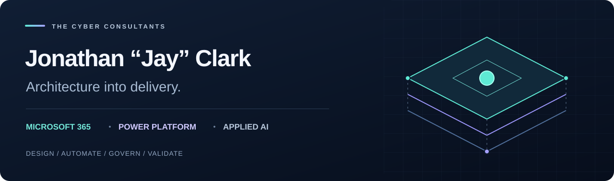

  

  <strong><a href="evidence/README.md">PROJECT EVIDENCE</a> &nbsp; / &nbsp; <a href="power-platform/README.md">POWER PLATFORM</a> &nbsp; / &nbsp; <a href="case-studies/README.md">CASE STUDIES</a></strong>

# Architecture that connects to delivery.

I’m **Jonathan “Jay” Clark**. I connect business processes, governed information, and automation across Microsoft 365, Power Platform, and applied AI. This portfolio brings together the architecture, implementation details, and engineering methods behind that work.

**21+ years in enterprise IT** · **The Cyber Consultants** · **Open to platform leadership and solutions architecture opportunities**

---

## Explore the work

<table>
<tr>
<td width="50%" valign="top">

### 01 / SharePoint DMS
**Architecture · PowerShell · Reconciliation**

Multi-site document management, destination readiness, migration planning, and scoped validation.

**Evidence:** A recorded 1,305-file pilot, documented exceptions, and runnable synthetic samples. Broader rollout remains in progress.

[Explore case study →](case-studies/property-portfolio-dms/README.md) · [Run the samples](evidence/verification-guide.md)

</td>
<td width="50%" valign="top">

### 02 / Power Platform governance
**Ownership · Solutions · Operations**

Centralized automation ownership, recovery of flows belonging to departed owners, and maintainable connection references.

**Evidence:** Reported 162-flow governance transformation. Scope and production continuity are described in the project account.

[Explore governance →](power-platform/platform-ownership.md) · [Claim PP-001](evidence/claim-register.md)

</td>
</tr>
<tr>
<td width="50%" valign="top">

### 03 / Business applications
**Power Apps · SharePoint · Power Automate**

Engagement-letter modernization, employee recognition, and tax-service intake with typed data and workflow integration.

**Evidence:** Reviewed control behavior, generalized formulas, and troubleshooting. Acceptance status is documented per application.

[Explore applications →](power-platform/README.md) · [View Power Fx](power-platform/power-fx-examples.md)

</td>
<td width="50%" valign="top">

### 04 / AI & knowledge systems
**Copilot Studio · RAG · MCP**

Grounded support, controlled escalation, and proposed boundaries between AI reasoning, enterprise knowledge, and tool execution.

**Evidence:** Reported help-desk delivery; separately labeled evaluation patterns and proposed MCP architecture.

[Explore AI patterns →](copilot-ai/README.md) · [View MCP design](mcp/tcc-core-mcp/README.md)

</td>
</tr>
</table>

## Follow the evidence

**[Open the Project Evidence Portfolio →](evidence/README.md)**

A short path from a professional claim to its supporting material:

**Claim → Architecture → Implementation → Verification → Results & limits**

| Start with | What you can inspect |
| --- | --- |
| [Evidence register](evidence/claim-register.md) | Seven stable IDs connecting contributions to artifacts and acceptance status |
| [Offline verification](evidence/verification-guide.md) | Synthetic tests for mapping, readiness, reconciliation, and rejected inputs |
| [DMS results](case-studies/property-portfolio-dms/outcomes.md) | Pilot metrics, unresolved historical identities, and measurement boundaries |
| [Application testing](power-platform/testing-and-troubleshooting.md) | Failure scenarios, troubleshooting, and open acceptance work |

## Engineering focus

| Microsoft 365 | Power Platform | Applied AI | Delivery |
| --- | --- | --- | --- |
| SharePoint information architecture | Power Apps & Power Fx | Copilot Studio | PowerShell & PnP |
| Identity & access boundaries | Power Automate | Grounded knowledge & RAG | Microsoft Graph & APIs |
| Governance & document lifecycle | Solutions & connection references | Controlled tool integration | Migration & reconciliation |
| Operational ownership | Release & support practices | Evaluation patterns | Runbooks & recovery |

[Architecture decisions](architecture/README.md) · [Governance principles](governance/README.md) · [Career case studies](case-studies/README.md) · [GitHub profile](https://github.com/jclark1377)

<strong>How to read this portfolio</strong>

Public material includes reported professional experience, reviewed implementation details, historical aggregate results, synthetic code samples, and proposed reference designs. These categories are identified in the evidence register.

The DMS pilot’s 1,305 files are distinct from the approximately 115,000-file / 347 GB broader source estate. Its path reconciliation does not establish full historical identity, version, permission, or byte-level verification. TCC Core MCP remains a proposed reference design. Application acceptance is not inferred from a diagram or formula example.

Employer-owned source, customer records, credentials, tenant identifiers, and private endpoints are excluded. [Publication standard](evidence/artifact-template.md).

---

**Jonathan “Jay” Clark** · Microsoft 365 / Power Platform / Enterprise AI & Solutions Architecture
