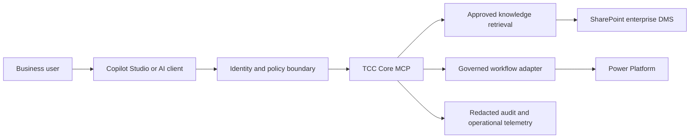

# Architecture
[Back to portfolio](../README.md)

## Reference landscape

This is a logical target design. Client compatibility, authentication flows, connectors, licensing, and deployment topology must be validated before implementation.

## Decision record — separate AI reasoning from execution
**Status:** Proposed. **Context:** Natural-language requests can be ambiguous, and retrieved content may contain untrusted instructions.

**Decision:** Keep authorization, input validation, and execution policy in the service boundary. An AI response cannot grant access or approve its own tool execution. Begin with read-only tools; introduce writes only with explicit scope and approval.

**Tradeoff:** Additional service and policy work increases implementation effort but makes behavior easier to test and audit.

## Delivery gates
| Gate | Evidence required |
| --- | --- |
| Discovery | Named business owner, scoped use cases, data inventory, and access model |
| Design | Data-flow review, threat assessment, and documented integration contracts |
| Pilot | Permission-boundary tests, representative evaluations, and failure recovery |
| Release | Approved configuration, monitoring, support owner, and rollback plan |

Related: [TCC Core MCP](../mcp/tcc-core-mcp/README.md) · [Governance](../governance/README.md)
