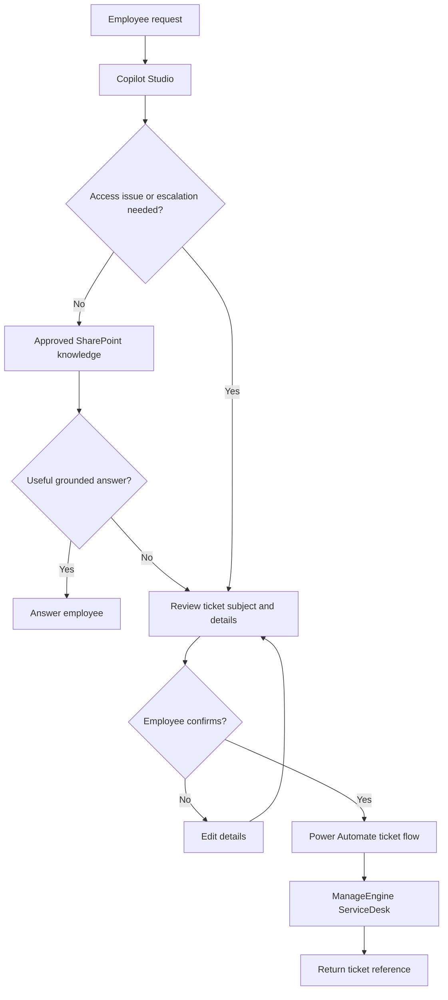
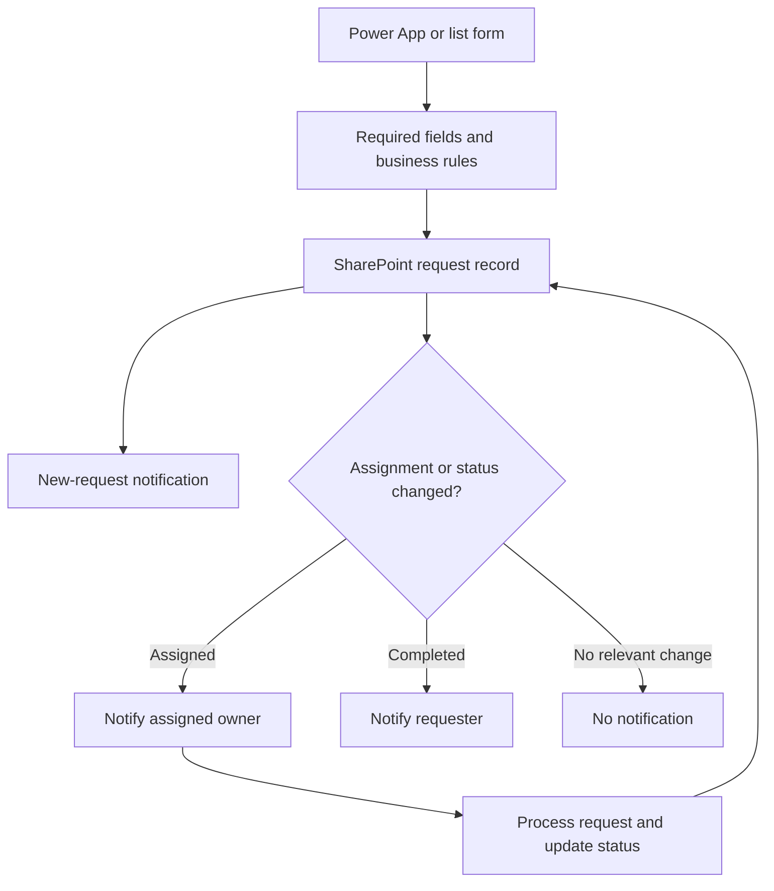
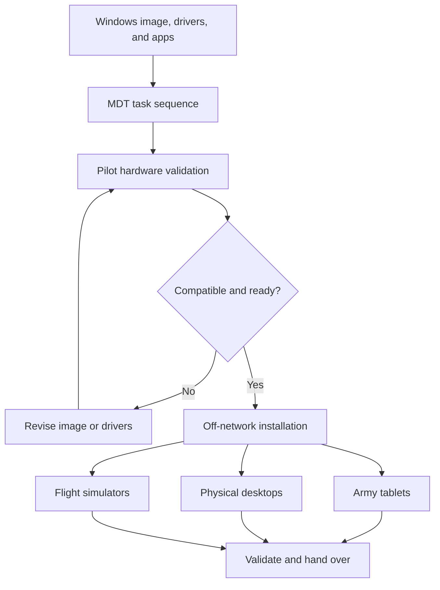
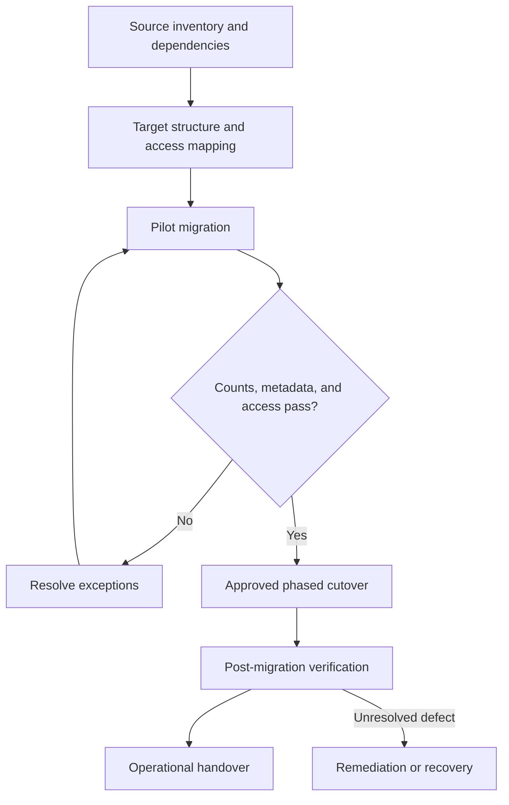
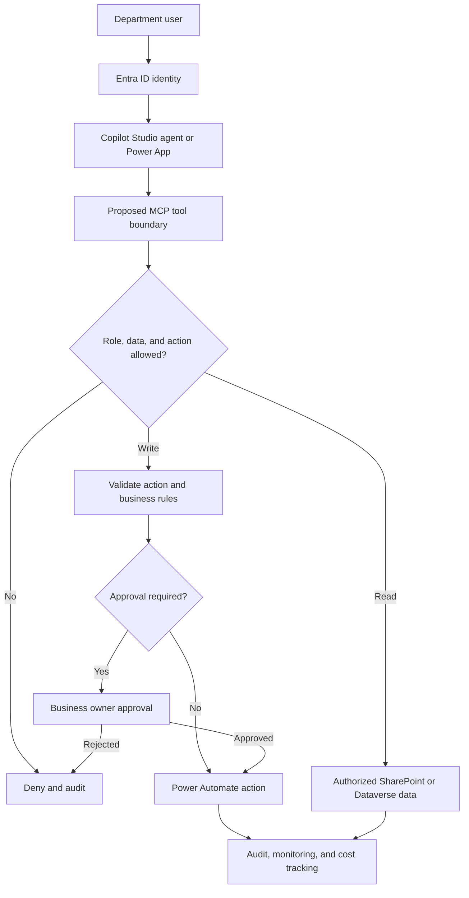

# Career Projects & Case Studies

[Back to portfolio](../README.md)

Selected work across enterprise IT, Microsoft 365, applied AI, and independent consulting. These are professional experience summaries based on my resume and project records, updated October 6, 2026. They describe my contribution; employer-owned implementations and internal evidence are not distributed in this repository. Reference designs are labeled separately.

## Power Apps case studies

**[Power Apps & Power Platform collection](../power-platform/README.md)** — [Audit Engagement Letter app](../power-platform/audit-engagement-letter/README.md), [employee recognition](../power-platform/employee-recognition/README.md), and [tax-service intake](../power-platform/tax-service-intake/README.md).

The collection adds control-level examples, generalized architecture and SharePoint schemas, Power Automate integration, DEV/UAT/PROD practices, and test scenarios. Reported delivery, observed configuration, and illustrative patterns are labeled separately; recognition and tax-intake acceptance remain open.

## Project highlights

| Work | Contribution and scale | Status |
| --- | --- | --- |
| Help Desk Copilot | Copilot Studio, approved SharePoint knowledge, Power Automate, and ManageEngine ServiceDesk ticket creation | Production deployment reported in resume |
| Power Automate governance | Migrated 162 individually owned flows to centralized service-account ownership, Solutions, and connection references | Delivered |
| SharePoint governance | Ownership, lifecycle, permissions, metadata, and compliance visibility across approximately 800 sites | Professional experience |
| Enterprise recovery | Recovered 12,302 of 13,558 items (90.7%); established validation and remediation procedures | Completed recovery result |
| Consulting DMS and migration | Multi-site SharePoint DMS; assessment of approximately 115,000 files / 347 GB; resumable Azure Automation migration | DMS provisioned; migration in progress |
| Private RAG and MCP | Document normalization, chunking, embeddings, metadata-filtered retrieval, and separate tool services | Architecture / prototype work |

Scale figures describe the relevant estate or source inventory, not personal throughput. Migration inventory is not a claim that every file has been migrated. Recovery counts are a resume-reported result; underlying incident records are not public.

## Warren Averett

**Cloud Systems Administrator (AI & Microsoft 365 / Power Platform) | January 2026 - present**

### Production Tier-1 Help Desk Copilot

**Problem:** First-line support needed structured intake, approved knowledge, and a reliable escalation path.

**My contribution:** Architected and deployed a Copilot Studio agent grounded in approved SharePoint knowledge, with Power Automate integration to ManageEngine ServiceDesk. Defined instructions, fallback behavior, security guardrails, and human escalation. Prepared retrieval tests, response-consistency checks, and failure scenarios before release.

**Result:** Moved first-line support from inbox triage toward governed intake and automated ticket creation. No ticket-deflection percentage or time-saving estimate is claimed here.

**Stack:** Copilot Studio, SharePoint Online, Power Automate, ManageEngine ServiceDesk.

### Help Desk request and escalation flow

Logical view of the reported implementation.

### Power Platform governance and business workflows

- Re-architected ownership of **162 Power Automate flows** using centralized service accounts, Solutions, connection references, and PowerShell-driven deployment.
- Built Power Apps and Power Automate solutions for **Audit Engagement Letters, Company Kudos, and SALT Tax intake**, using structured SharePoint data, conditional logic, approvals, comments, and status tracking.
- Recent Company Kudos work addressed multi-select data shaping, Teams message formatting, mentions, notification sequencing, and posted-status tracking. The latest notes still included testing; full acceptance is not asserted.
- Recent SALT work separated new-request notification from assignment/completion processing and investigated unnecessary item updates and stalled runs. This remains an active troubleshooting effort in the latest project record.

**Engineering emphasis:** Supportable ownership, explicit workflow states, reliable connector references, and validation of side effects.

### Departmental request workflow

Generalized intake pattern informed by SALT and business applications. Notifications depend on relevant changes.

### AI knowledge architecture

Designed a private ingestion pattern from documents through Markdown normalization, semantic chunks, embeddings, and metadata-filtered vector retrieval. Evaluated cloud and self-hosted retrieval boundaries. Prototyped ticket classification, priority/assignment recommendations, and structured AI output. MCP integration and private RAG designs are presented as architecture/prototype work rather than a claim of a deployed TCC Core MCP server.

## The Cyber Consultants

**Principal Consultant - Microsoft 365 / SharePoint | Ongoing**

### Property portfolio document management and migration

**Problem:** Organize a large document estate into a governed, multi-site SharePoint DMS while preserving document context and supporting controlled migration.

**My contribution:** Delivered hub architecture, content types, Document Sets, managed metadata, and PnP PowerShell provisioning. Project planning covered approximately **115,000 source files / 347 GB**, a **58-column DMS schema**, an **18-field provisioning workflow**, and **13 construction subtypes**.

**Latest engineering work:** Developed a chunked Azure Automation migration design after long-running jobs encountered runtime limits. The migration logic supports approximately 400 files per job, checkpoint-based resumption, existing-file checks, Created/Modified/Author/Editor preservation, reserved-character handling, structured JSON results, and final source/target reconciliation.

**Status:** The latest work record reports a successfully completed resumed chunk. Overall migration and final acceptance remain in progress. Monitoring dependency troubleshooting and Power Automate notification integration were still underway.

**What this demonstrates:** Translating business taxonomy into SharePoint information architecture, automating repeatable provisioning, and designing migration recovery around platform constraints.

[Review the generalized DMS architecture](../sharepoint/enterprise-dms/README.md)

### Private customer knowledge architecture

Designed reusable AI-assistant boundaries separating source documents, ingestion, vector retrieval, MCP tools, and LLM reasoning. Customer environments and indexes remain separate in the design. The public [TCC Core MCP](../mcp/tcc-core-mcp/README.md) artifact is a proposed reference architecture.

## Missile Defense Agency (DoD)

**Senior Systems Engineer / Enterprise Architect | January 2023 - December 2025**

- Provided enterprise architecture and modernization guidance for environments serving **10,000+ users and 30,000+ endpoints**.
- Supported Zero Trust and Azure modernization across identity, device posture, least privilege, access control, and governance.
- Planned SharePoint migration from discovery through validation; developed PowerShell automation and runbooks for inventory, dependencies, permissions, pilots, exceptions, cutover, and post-migration verification.

**Portfolio focus:** Enterprise scale, migration discipline, and governance. Only high-level professional experience is described here.

## Lockheed Martin

**IT Space Engineer / Senior Systems Administrator | March 2022 - January 2023**

Delivered Microsoft Teams deployment and migration, enterprise data migration, and Windows 11 modernization. Administered Windows Server, Active Directory, Microsoft 365, Azure, Exchange Online, and Entra ID for an environment of approximately **2,000 users**.

**Portfolio focus:** Coordinating collaboration, endpoint, identity, and infrastructure changes across a shared enterprise environment.

## SAIC

**Systems Administrator II | June 2021 - January 2022**

Engineered off-network OS deployment with Microsoft Deployment Toolkit (MDT), standardized images, task sequences, drivers, applications, and PowerShell automation for training and simulation environments.

**Portfolio focus:** Repeatable provisioning in environments with constrained connectivity. My existing public MDT repository is a fork; upstream scripts retain their original attribution.

## Birmingham-Jefferson County Transit Authority

**Systems Administrator | August 2018 - June 2021**

Supported approximately **350 employees** and built HR/Finance workflow automation using Microsoft Flow / Power Automate and SharePoint for requests, approvals, and notifications.

**Portfolio focus:** Turning departmental business processes into structured, trackable workflows.

## Avenu Insights

**Senior Desktop Administrator | April 2016 - August 2018**

Supported acquisition integration, endpoint discovery, lifecycle planning, and ServiceNow-driven troubleshooting standardization.

**Portfolio focus:** Operational consistency through inventory, lifecycle management, and documented support practices.

## Cunningham Pathology

**Systems Administrator | Earlier career**

Supported approximately **50 physician offices** across Windows, Office 365, Exchange, SharePoint, identity, and acquisition technology stand-up.

**Portfolio focus:** Multi-location infrastructure support and integration of acquired offices.

## Illustrative solution scenarios

The following remain design exercises, separate from the professional experience above.

### Governed enterprise knowledge assistant

**Situation:** Teams need approved procedures across fragmented collections.

**Design:** Establish SharePoint ownership and metadata, expose permission-aware retrieval through the proposed MCP boundary, and provide grounded answers with citations and escalation.

**Validation:** Known-answer questions, missing evidence, restricted documents, stale content, and malicious instructions in retrieved pages. Collect search success, grounded-answer rate, access-control failures, latency, and feedback.

[Review the reference design](../mcp/tcc-core-mcp/README.md)

### Document migration with controlled approval

**Situation:** Move shared documents into a managed document service while preserving ownership and access.

**Design:** Inventory and classify sources, pilot mappings, reconcile results, and approve exceptions and acceptance.

**Validation:** Item counts, exceptions, content integrity, metadata, access, links, and recovery rehearsal. Collect reconciliation rate, unresolved exceptions, access defects, and post-cutover support demand.

[Review the DMS runbook](../sharepoint/enterprise-dms/README.md) · [Review automation controls](../power-platform/README.md)
## Architecture contributions across SAIC, Lockheed Martin, DoD, and Warren Averett
Updated October 6, 2026. This progression connects Windows endpoint engineering and enterprise migration to governed business applications and AI architecture. User and device counts describe supported environments; they are not direct-report counts.
| Organization | Architecture contribution | Scope and evidence |
| --- | --- | --- |
| SAIC | Windows deployment design for Army unmanned-aircraft tablets, physical training systems, and flight simulators; standardized images, MDT task sequences, drivers, and applications for off-network OS installation. Maintained the pilot training environment and supported flight-simulator integration. | Professional experience, June 2021–January 2022. Tablet imaging and Windows 11 design described in my project history. |
| Lockheed Martin | Microsoft Teams deployment, enterprise data migration, and Windows 11 modernization across collaboration, endpoint, identity, and infrastructure services. | Professional experience, March 2022–January 2023; environment serving approximately 2,000 users. |
| Missile Defense Agency / DoD | Target-state architecture, modernization roadmaps, SharePoint migration planning, identity and device controls, and operational runbooks. | Professional experience, January 2023–December 2025; environment serving 10,000+ users and 30,000+ endpoints. |
| Warren Averett | Copilot Studio help-desk architecture, SharePoint governance, Power Platform ownership and ALM, and departmental intake applications and automation. | January 2026–present; approximately 800 help-desk users, 796 SharePoint sites, and 162 flows in the governance project. |
### SAIC: tablet, desktop, and flight-simulator deployment
**Business need:** Provide repeatable Windows provisioning for physical systems supporting pilots and aircraft mechanics, including systems requiring off-network installation.
**My contribution:** Designed Windows deployment configurations, maintained the pilot training environment, and used MDT to install operating systems on flight simulators. The deployment work covered images, task sequences, application installation, driver handling, and validation. Windows 11 implementation is part of the endpoint design experience; specific rollout dates and fleet-wide completion are not claimed.
**Architecture considerations:** Hardware and application compatibility, repeatable installation, constrained connectivity, support ownership, and recovery procedures. These considerations explain the design approach without publishing internal system details.

#### Endpoint deployment flow

Sanitized reconstruction of the deployment approach.

### Enterprise migration and endpoint modernization
My Lockheed Martin work connected Teams and enterprise data migration with Windows 11 upgrades. At DoD, my architecture contribution extended to modernization planning, migration sequencing, permissions, identity, device posture, pilots, exceptions, cutover, and post-migration verification. These experiences connect endpoint implementation to enterprise platform decisions.

#### Migration validation and cutover

Generalized delivery pattern informed by collaboration and data migration experience.

### Departmental AI, Copilot, and applications — proof of concept
**Business need:** Let departments request agents and applications while retaining common identity, information ownership, deployment controls, and support processes.
**Proposed design:** Departmental Copilot Studio agents and Power Apps use approved SharePoint or Dataverse data. Power Automate handles workflow actions. A proposed central MCP service exposes approved tools with Entra ID authentication and role-based authorization. Each tool validates access to the requested data and action.
**Connection to delivered work:** The Help Desk assistant demonstrates knowledge grounding and escalation; SALT intake demonstrates assignment and completion workflows; Kudos demonstrates structured intake and Teams notifications; Engagement Letters demonstrates conditional forms and business rules. These projects inform the shared design.
**Status:** Departmental architecture proof of concept. Central MCP deployment, organization-wide rollout, and measured business outcomes are not asserted. Validation should cover cross-department access, denied actions, approvals, audit records, failure recovery, latency, and usage cost.

#### Departmental AI access and action boundaries

Proposed proof-of-concept topology. Authorization is checked by the service for each action.

