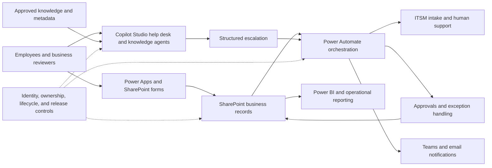

# Architecture overview
[Collection overview](README.md)

This is a generalized synthesis of the reported projects, not a diagram exported from the organization's environment.

## Boundaries that matter
User-facing interfaces collect intent; SharePoint holds structured state; flows coordinate events and integrations. Approvals and sensitive IT actions require a separate authority boundary. The AI component can help summarize or retrieve, but its output does not confer permissions.

The supplied Help Desk description includes an existing email-to-ticket route into ManageEngine. This package does not assume every interaction used a custom API connector.

Resume-reported governance includes service accounts, service principals, and connection references. These are different mechanisms: workload ownership, application identity, and connection binding should be evaluated separately rather than described as interchangeable.

## Delivery lifecycle
Discover requirements → define the data contract → establish identity and ownership → build the workflow or agent → exercise representative and failure scenarios → review evidence → release through an approved environment process → monitor and refine.

## Public design improvements
Use explicit states for each external effect, persist an operation reference, and treat ambiguous delivery as an exception. A single “posted” Boolean plus a later update does not establish exactly-once delivery. An agent's confidence score does not replace source evidence or human approval.

The diagrams and controls explain the architecture; they do not claim that every recommended control was deployed.
