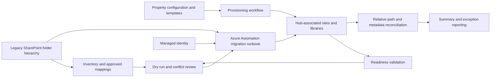

# Solution architecture
[Case study](README.md)

## Delivery architecture

The diagram summarizes reviewed implementation and execution records. It does not imply that every provisioning path was successfully executed through Azure Automation.

## Information boundaries
| Component | Responsibility | Design consideration |
| --- | --- | --- |
| Portfolio hub | Shared navigation and association | Hub association was validated independently of site creation |
| Hotel property site | Property-specific DMS | Template-driven libraries, content types, folders, and metadata defaults |
| Commercial site | Property libraries | Resolve actual library roots; display names need not equal URLs |
| Management-company path | Separate provisioning configuration | Present in the reviewed provisioning source; no production outcome claimed here |
| Acquisition hub option | Alternate provisioning association | Present in the reviewed provisioning design; distinct from proven Commercial readiness |
| Automation runtime | Unattended migration | Managed identity, explicit connections, compatible modules, and accessible assets |
| Reports | Operational evidence | Keep raw reports private; publish aggregates only |

## Tradeoffs
**Template reuse versus drift:** reusable configuration reduces repeated setup, but readiness must recheck the deployed state. A checkpoint records completed stages; it does not prove the destination remains correct.

**Copy completion versus acceptance:** the migration summary proves the measured checks only. A path match does not establish byte integrity, identical permissions, full version preservation, or business sign-off.

**Safe reruns versus existing content:** the reviewed runbook skips copying an existing destination file, but still attempts metadata updates. Existing content needs explicit conflict review; presence alone is not equivalence.

**Identity versus credentials:** the supplied migration code uses managed identity for both connections. Required grants remain an administrative prerequisite; this portfolio does not publish tenant grants or imply that authentication alone supplies authorization.

## Relationship to Copilot
Consistent metadata and ownership can support future governed retrieval. Permission-aware retrieval, grounding evaluation, and AI access tests remain separate work. No deployed Copilot integration or AI performance gain is claimed for this engagement.

Technical reference: [PnP managed-identity connection syntax](https://pnp.github.io/powershell/cmdlets/Connect-PnPOnline.html).
