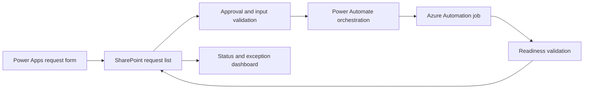

# Planned Power Apps provisioning control center
[Case study](README.md)

**Status: planned architecture.** The conversation includes a proposed SharePoint control list and an app concept. It does not establish a deployed app, production flow, or successful end-to-end controller run.

## Operator experience
An operator requests a new property environment, supplies its type and approved ownership, selects an approved hub, and sees provisioning and validation status. Failures remain visible with an actionable stage and a controlled retry option.

## Proposed request contract
| Field | Purpose |
| --- | --- |
| Request reference | Correlation and duplicate prevention |
| Property label and code | Approved configuration inputs |
| Site type | Hotel, Commercial, or Management Company |
| Hub selection | Constrained approved association |
| Owners | Validated responsible principals |
| Requested operation | Validate, provision, or authorized retry |
| Status and stage | Submitted, Approved, Running, Review, Completed, or Failed |
| Readiness flags | Result of validation, not a user-entered success value |
| Job reference | Private link to execution evidence |
| Failure summary | Sanitized operational feedback |

## Controls to implement
Revalidate approvals and configuration immediately before dispatch. Use a stable request reference to prevent duplicate jobs. Define bounded retries and preserve the original failure. A successful job must still produce readiness evidence before a request becomes Completed.

Keep privileged execution outside the app user's direct control. Constrain site types, hubs, and template choices; do not accept arbitrary script text or arbitrary destinations. Separate request permissions from executor privileges.

## Delivery backlog and acceptance
1. Confirm the request schema and supported provisioning paths.
2. Implement validation and approval transitions.
3. Connect job dispatch and status polling with duplicate protection.
4. Map structured readiness output back into the request record.
5. Test rejected inputs, duplicate submissions, permission errors, runtime failures, retries, and incomplete readiness.
6. Validate operational ownership and support before production release.

Copilot-assisted request intake could be considered later, but it would not bypass approval or readiness gates. It is not a completed feature.
