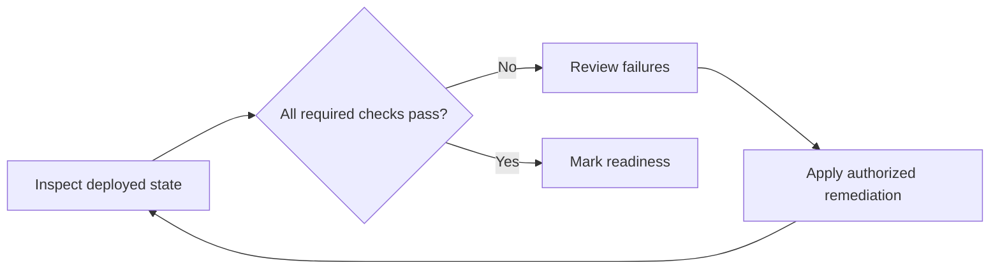

# Provisioning automation and readiness
[Case study](README.md)

## Patterns in the reviewed work
The provided provisioning source supports hotel and management-company paths, create-or-update behavior, template imports, content types, Document Sets, baseline folders, taxonomy defaults, hub selection, and end-to-end validation. Hotel stage checkpoints support resume and check for changed configuration/script/template inputs.

These are source-level capabilities. The case study does not claim that every option was exercised successfully in production or publish the customer's templates.

Commercial work separately established required libraries and corrected owner and hub readiness. The final user-supplied report records both readiness flags as true and zero failures.

## Readiness is a separate result
A published runbook is not an executed deployment. During Commercial automation work, published jobs encountered runtime and asset-path failures. The successful final readiness output verifies destination state; it does not erase those earlier job failures or prove that the new cloud provisioning path completed end to end.

A readiness contract should record:
- Expected versus actual hub association.
- Required owners and administrative access.
- Required libraries and resolved roots.
- Required content types, fields, and defaults for the selected site type.
- ProvisioningReady, MigrationReady, and individual failures.
- A correlation reference and timestamp in private operational reporting.

The sample validator evaluates a synthetic observation snapshot. It demonstrates completeness checks and aggregate readiness; it does not query a live tenant.

## Remediation loop

Keep inspection repeatable and separate mutations from validation. Rerun after remediation instead of setting success based only on a successful command invocation.

See [planned control center](provisioning-control-center.md) for how these reports could become an operator-facing workflow.
