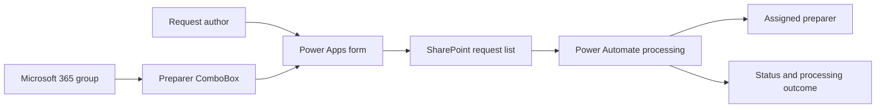

# Audit Engagement Letter app
[Power Apps portfolio](../README.md)

**Power Apps • SharePoint • Power Automate • Legacy form modernization**

## Business problem and contribution

The engagement-letter workflow needed a modern form experience in place of legacy InfoPath forms, with structured request data and an accountable person responsible for preparing a letter. The existing professional record describes a built Power Apps, SharePoint, and Power Automate solution spanning approximately **65 fields and eight screens**. Those figures describe reported scope; they are not independently recounted from an app export.

My contribution represented here is form modernization, SharePoint integration, workflow integration, and hands-on troubleshooting of a required group-backed person picker. The reviewed app configuration demonstrates a single-select ComboBox, required data card, directory display-name search, mapping to a SharePoint Person record, and field-level error feedback.

## Requirements

| Requirement | Evidence or treatment |
| --- | --- |
| Replace the legacy form experience | Reported project scope |
| Assign a letter preparer from a designated Microsoft 365 group | Observed control configuration, generalized role name |
| Require a preparer before submission | Required data card observed |
| Save a valid SharePoint Person value | Claims, display name, and email mapping observed |
| Keep the list usable as group membership changes | User-reported troubleshooting requirement; final resolution unverified |
| Validate all screens before final submission; preserve input after failure | Recommended acceptance requirement |
| Track workflow status and distinguish saved data from completed processing | Recommended integration requirement |

## Architecture

The high-level product combination is reported. The sequence below is a **sanitized reference architecture**, not a recovered production flow.

SharePoint persists business data; Power Apps supplies the form experience; Power Automate handles downstream processing. The picker narrows selection to the intended group, but it does not grant or enforce access to SharePoint. Authorization must be enforced at the data and service boundaries.

## Controls and data model

The most concrete implementation detail is the preparer field. Its selection source returns directory records with `displayName` and `mail`; its update value maps the selected person into SharePoint's person-field shape. A missing mail value returns blank, which must be handled by required-field validation.

See [Power Fx examples](../power-fx-examples.md) for independently written illustrations and [SharePoint models](../data-models.md) for the synthetic request schema. Only the preparer control's behavior is directly supported by the reviewed configuration; the public schema does not reconstruct all 65 reported fields or disclose internal field names.

## Power Automate integration

The project record supports Power Automate integration, but does not establish the exact trigger or every downstream action. The [reference integration contract](../flow-integration.md) starts processing after successful persistence, re-reads current state, validates routing, and records success or failure separately.

Automatic document generation, template merging, e-signatures, external delivery, and completed approval routing are **not established by the reviewed evidence**.

## ALM, testing, and troubleshooting

The [DEV/UAT/PROD approach](../alm-and-operations.md) describes how to package supported components, bind environment-specific configuration, provision SharePoint separately, and collect acceptance evidence.

The observed troubleshooting issue was a newly added group member not appearing in the picker. A disciplined investigation checks the configured group, membership, connector output, app-local collections, record shape, and pagination before changing the control. The reviewed discussion does not establish a final successful save for that member.

Priority tests are: required preparer missing; valid selection saved and reopened; existing selection displayed in edit mode; new member returned by the connector; missing mail; connector error; list permission denied; and multi-screen validation. See the [test matrix](../testing-and-troubleshooting.md).

## Results and limits

- Built modernization reported across approximately 65 fields and eight screens.
- Concrete implementation evidence for the group-backed person picker and SharePoint mapping.
- Demonstrates integration and troubleshooting depth beyond a static form mockup.
- Final acceptance, adoption, cycle-time reduction, and production reliability metrics were not supplied.

[Evidence and publication scope](../evidence-and-results.md)
