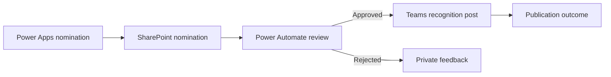

# Employee recognition workflow
[Power Apps portfolio](../README.md)

**Power Apps • SharePoint • Power Automate • Teams**

## Business problem and contribution

Employee nominations need a consistent intake process, review decisions, and a clear recognition message. The documented work combines a Power Apps form, SharePoint records, approvals, rejection comments, and Teams publishing.

My represented contribution covers the app/workflow integration and iterative notification presentation. Prior portfolio records document app/flow configuration and test messages; later user feedback requests clearer author attribution and placing the recipient mention within the recognition sentence.

## Requirements and architecture

Requirements represented in the project record include nomination intake, review, rejection feedback, and Teams publication. The following sequence is a **generalized reference model**; it does not certify every branch as accepted.

The public [data model](../data-models.md) separates nomination text, the nominated person, submitter, decision, and publication status. Business approval and successful publication are separate outcomes.

## Key controls and integration

Recommended form controls include a person picker, required recognition text, and clear save/error feedback. Generic [Power Fx patterns](../power-fx-examples.md) show save handling; they are not the original recognition-app formulas.

The workflow should preserve the decision and comments, then publish only approved content. A rejection must not produce a recognition post. The [integration guide](../flow-integration.md) describes the publication guard and recovery pattern.

Teams posting identity is determined by the selected connector action and connection. A nomination author can be attributed in message content; changing a displayed name does not authenticate the post as that person. The actual supported posting mode and mention behavior require a test in the target environment.

## Testing and troubleshooting

Observed feedback concerned the apparent author of the Teams post, mention placement, and full-length message presentation. These are useful acceptance cases: a correct workflow outcome still needs readable, accurate output.

Test approval, rejection with comments, long text, special characters, missing recipient, mention placement, and publish failure. Verify that retrying publication does not create duplicate posts. Confirm rendering in the Teams clients used by the business.

## ALM and results

Use the shared [release approach](../alm-and-operations.md), with test-only recipients and a dedicated UAT publication destination.

App/flow work and test outputs are documented. Later presentation corrections remain in testing; final acceptance and measured engagement improvement are not claimed. No employee recognition text, names, channel identifiers, or screenshots are published.

[Testing matrix](../testing-and-troubleshooting.md) · [Evidence](../evidence-and-results.md)
