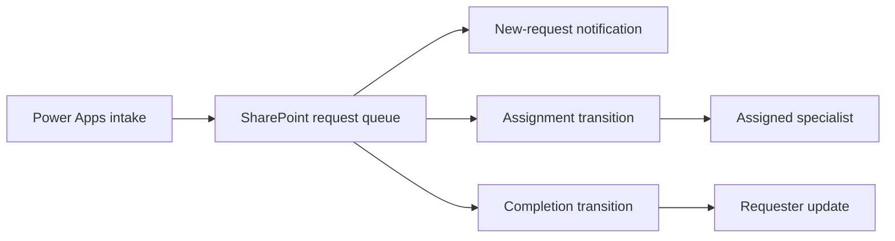

# Tax-service intake and routing
[Power Apps portfolio](../README.md)

**Power Apps • SharePoint • Power Automate • Business request processing**

## Business problem and contribution

A specialist service team needs structured requests, understandable service categories, assignment visibility, and lifecycle notifications. The professional record reports a built Power Apps solution; the detailed evidence reviewed for this case study is strongest for SharePoint and Power Automate integration.

My contribution represented here covers request intake integration, multi-select data shaping, assignment/completion processing, and diagnosis of notification failures. The material does not establish the full canvas-app screen structure.

## Requirements and architecture

| Requirement | Public treatment |
| --- | --- |
| Capture request details and multiple service categories | Generalized from reviewed payloads |
| Distinguish a new request from an assigned request | Required correction exposed by testing |
| Display person names instead of serialized user objects | Observed formatting defect |
| Handle an absent assignee without sending to an empty recipient | Observed runtime failure |
| Notify on assignment and completion | Documented workstream; complete acceptance unverified |
| Preserve multi-select field data | Recommended write-validation control |

This is a **reference event decomposition**, not an exported flow diagram. Creation, assignment, and completion are separate events with different recipient rules.

## Data and controls

The [synthetic schema](../data-models.md) models a person contact, optional assignee at creation, multi-choice service categories, urgency, notes, and status.

The reviewed notification payload showed a person object inserted directly into text and a null recipient. A display label should use the intended scalar name property. Multi-choice values should be shaped to a list of strings for display while preserving the connector-required array shape on writes. Display formatting and stored data are different contracts.

## Integration and troubleshooting

The reviewed runtime error reported an empty recipient. A later save-time error reported an invalid reference to a data-retrieval action. These prove that the workflow still needed correction; they do not prove successful end-to-end delivery.

The [integration guide](../flow-integration.md) specifies recipient validation, action-reference checks, and separate event handling. Falling back to an unrelated recipient is not automatically correct: the process owner must define who receives an unassigned request. A message must not say “assigned to you” unless assignment exists.

A notification-only flow should avoid unnecessary list writes. If a write is needed, preserve required and multi-select fields and ensure it cannot repeatedly trigger the same notification.

## Testing, ALM, and results

Use [DEV/UAT/PROD controls](../alm-and-operations.md) and the [test matrix](../testing-and-troubleshooting.md). Test creation without assignment, assignment/reassignment, zero/one/many categories, missing recipient, completion, duplicate triggers, and broken action references.

The work demonstrates practical integration troubleshooting using actual payloads and failures. Latest evidence leaves end-to-end acceptance open. No turnaround improvement, completed rollout, or error-rate reduction is claimed. Client records and internal service terminology are excluded.

[Evidence and results](../evidence-and-results.md)
